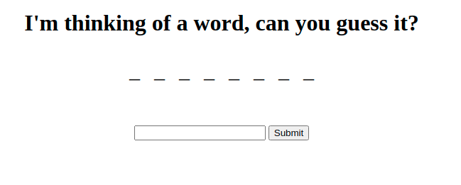
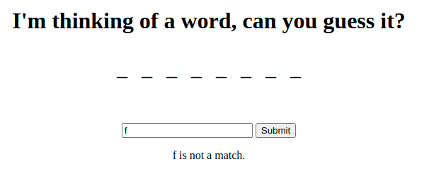
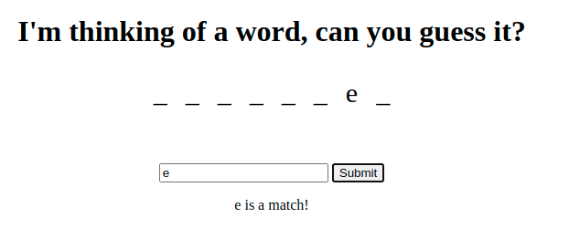
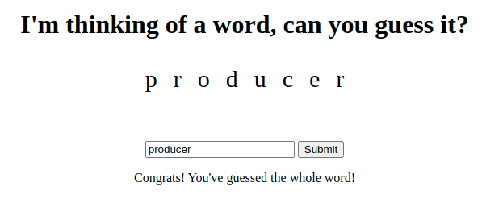

# Word Guesser

This project, you are building a word and letter guessing game (Think hangman!)

Fortunately, the starter code already has a substantial amount of coding done for you already! Just finish fleshing out the functionality!

## Functionality

<!-- * Store a list (or tuple) of 5 to 10 words in your script.
* Randomly choose a word from this list as the secret word.
* Display the unrevealed word as underscores (with the same length.) -->

<!-- - Prompt the user to enter a letter. -->

- If the letter is in the word, mark it as revealed and visually display that letter in the word.
<!-- - If the letter is incorrect, indicate to the user that the guess was incorrect. -->

### Hints

- Your game will need some state to keep track of the word, how many letters are yet to be guessed, and the current state of the hangman.
- You can initially represent the hangman as a decreasing number of guesses remaining.
- You can use the `in` keyword or `.includes()` to test to see if a letter is in the secret word.
- Remember to account for case differences.

### Pseudocode

<!-- 1. Initialize the game: Initialize all variables to default values.
2. Randomly select a secret word.
3. Display the word as blanks.
4. Ask the user for a letter. -->

<!-- 5. Determine if letter is correct or incorrect. -->
<!-- 6. If incorrect, tell the user it's incorrect. -->

7. If correct, add the letter to the guessed list, redraw the secret word with the new letter(s) showing.
8. When the word is fully revealed, tell the user they've won!

### How to draw that secret word?

Being able to render a word as some underscores and some letters will be a little bit of a challenge. What I would recommend is the following:

1. Make one variable to hold the secret word.
<!-- mine is word -->
2. Make one variable to hold every letter that the user guesses.
<!-- mine is guesses -->
3. Make one variable to hold the word as it is displayed.
<!-- mine is -->
4. To decide if you should render a blank underscore or render a correct letter, you can iterate over the secret word checking to see if each letter is in the guessed letter list. If it is, use the actual letter character. If it is not, use an underscore to represent a letter not yet guessed.

## No Match

## Match

## BONUS

Sometimes a user might have solved the answer without guessing every single letter. As a bonus implement a way for the user to guess the whole phrase instead of just one letter. Preferably, this should be case insensitive!

